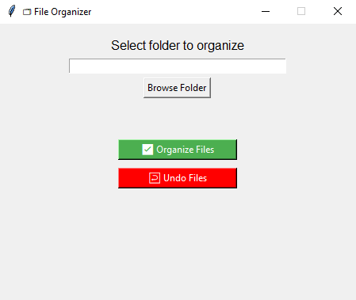
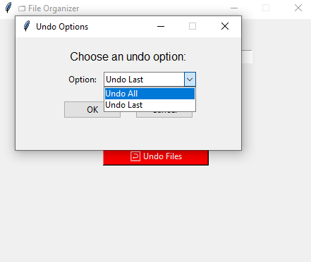
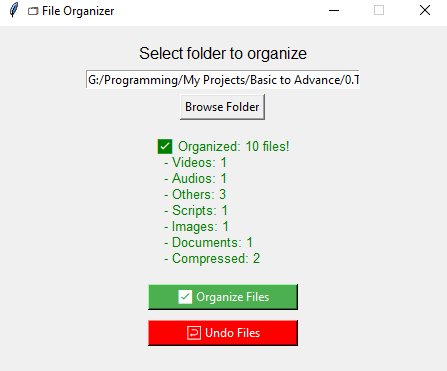
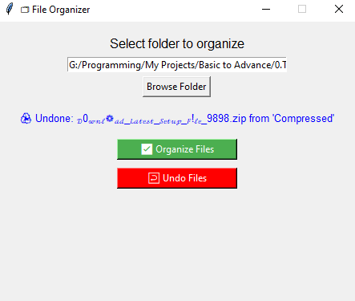
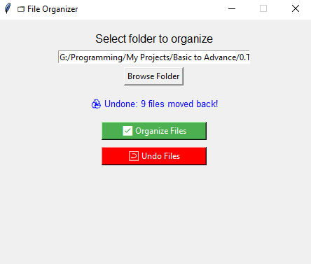

# 🗂️ File Organizer with Undo Functionality (Python + Tkinter)

A powerful and easy-to-use file organizer tool built using **Python** and **Tkinter**, that helps you manage your messy folders by organizing files by type — with **Undo Last / Undo All** support!

---

## 🚀 Features

- ✅ Organizes files by type (Images, Videos, Docs, etc.)
- ⏪ Undo support:
  - Undo **Last** moved file
  - Undo **All** moved files
- 💾 Maintains history in log file
- 🖥️ Clean and user-friendly GUI
- 📁 Safe — does not delete any files
- 🛑 Handles errors gracefully (invalid folders, missing files)
- 🔔 Alert and shake window if dialog already open

---

## 📸 Screenshots

| Home Interface | Undo Dialog |
|----------------|-------------|
|  |  |

| Organized | Undo Last | Undo All |
|-----------|-----------|----------|
|  |  |  |

---

## 🧪 How to Run

>💻 Requirements
>- Python 3.x (Tested on Python 3.10+)
>- Tkinter (usually included with Python)
>- No external dependencies required  

1. Install Python 3.6+ if not already installed.
2. Clone the repo or download the source files.
3. Run the main script:
4. Use the **Browse** button to select the folder you want to organize.
5. Click **Organize File** to start organizing.
6. Use the **Undo** button to undo file moves.


### 📦 Step-by-step

```bash...
# 1. Clone this repository
git clone https://github.com/Durlabhx/My-Projects/Python/File-Organizer.git
cd File-Organizer

# 2. Run the app
python file_organizer_GUI.py
```
---

## 📂 Project Structure

```text
Projects/Python/File-Organizer
│
├── file_organizer_GUI.py              # Main GUI code
├── file_organizer.py      # CLI Logic to organize & undo files
├── test.py                # nothing just to test any code
├── log.txt        # Keeps track of moved files
├── Widgets/
│   └── dialogs.py       # Custom Undo dialog
├── Screenshots/
│   │── home_interface.png 
│   │── status_organized.png
│   │── status_undo_all.png 
│   │── status_undo_last.png 
│   └── undo_dialog.png
└── README.md
```
---

## 🛠️ Possible Improvements

- [ ] Drag & Drop file/folder support
- [ ] System tray minimization
- [ ] Dark mode theme
- [ ] Export move logs to CSV
- [ ] Preview before organizing

---

## 🤝 Contributing

Contributions, feedback, and suggestions are welcome!  
If you'd like to help improve the tool, please fork this repository and submit a pull request.

Steps:

```bash
# Fork and clone the repository
git clone https://github.com/your-username/file-organizer.git

# Create your feature branch
git checkout -b feature/YourFeatureName

# Commit your changes
git commit -m "Added feature: XYZ"

# Push and create a PR
git push origin feature/YourFeatureName
```
---

## 📃 License
This project is licensed under the MIT License.

## ✨ Author
Created with 💻 by Durlabh Kashyap  
Feel free to connect / fork / improve!